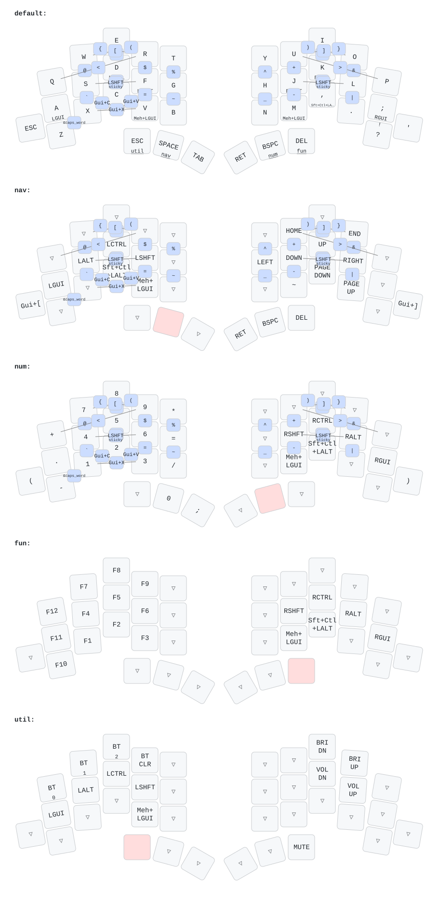

# ZMK firmware for the TOTEM keyboard

This repository contains my [ZMK](https://zmk.dev/) configuration for the
[TOTEM](https://github.com/GEIGEIGEIST/TOTEM), inspired by
[Miryoku](https://github.com/manna-harbour/miryoku_zmk) and
[urob's ZMK configuration](https://github.com/urob/zmk-config).

## Keymap

The diagram shows all five layers and all thirty combos. It is generated
automatically from [`config/totem.keymap`](./config/totem.keymap) and its
included configuration files by
[keymap-drawer](https://github.com/caksoylar/keymap-drawer). Changes to the ZMK
configuration regenerate and commit the SVG and parsed YAML automatically.

## Layout highlights

- The base layer uses QWERTY with home-row modifiers. On `A S D F`, holding a
  key produces GUI, Alt, Ctrl, or Shift. The order is mirrored on `J K L ;`.
- The far-left outer key is Escape and the far-right outer key is apostrophe.
  Those positions become browser back/forward on the navigation layer and
  parentheses on the number layer.
- The thumb keys provide Escape/Utility, Space/Navigation, Tab, Enter,
  Backspace/Number, and Delete/Function.
- `Z` + `X` activates Caps Word. `S` + `F` and `J` + `L` provide one-shot
  Shift.
- Symbols are primarily available through combos, while the alternate-hand
  layers keep modifiers on one hand and their main keys on the other.
- Bottom-row mod-taps provide Hyper (Shift + Ctrl + Alt + GUI) and Meh
  (Shift + Ctrl + Alt) for system shortcuts.

The home-row modifiers use opposite-hand triggers and release-based hold
decisions to support comfortable rolling key sequences.

